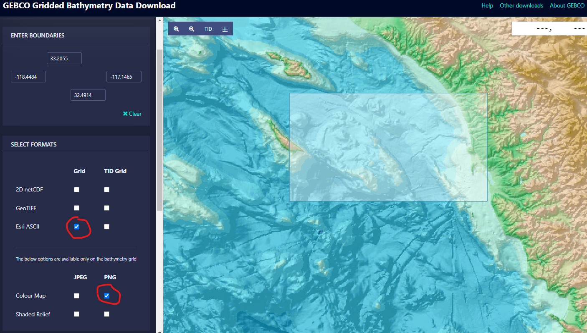
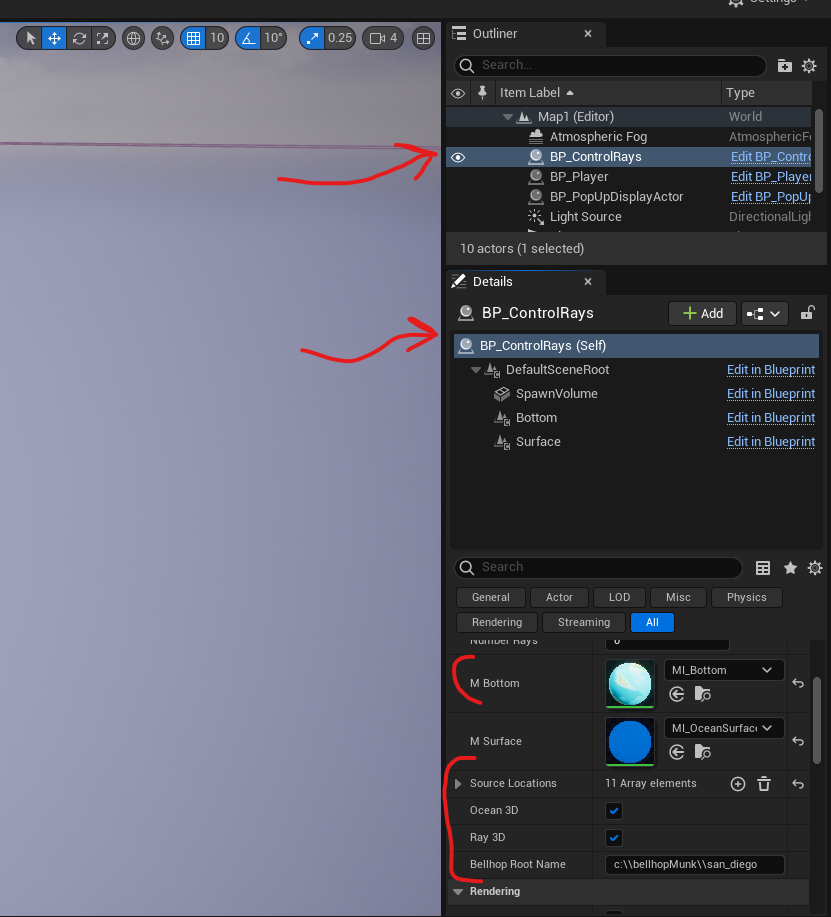

# GEBCO database
Instructions to import bathymetry data from [GEBCO](https://www.gebco.net/).

## TLDR;
Select a region on the website, download a ESRII ascii file (.asc), and convert to bellhop .bty.

## Example

We will download a region and convert the data for use un [UnrealInterface](https://github.com/A-New-BellHope/gebco_import).

1. Select a region



2. Download the *ESRI ASCII* and a *Colour Map*, following the instructions on GEBCO.

3. In the python tool, point the `infil` and `outfil` variables to your files. For example, to parse the included file:
```python
infil = open("gebco_2022_n33.7802_s32.3273_w-119.5189_e-116.992.asc", 'r')

outfil = open("san_diego.bty", 'w')
```
..* Tip - The script projects on the Earth with [geopy](https://pypi.org/project/geopy/).

4. At this point, the .bty file may be used in Bellhop as usual. To load it into Unreal, you can set the filename in the setting.


..* The environment file still has to exist.
..* Don't forget to escape the backslash in Windows.

5. In the same section in Unreal, you can set the bottom material to be the image you downloaded from GEBCO.

