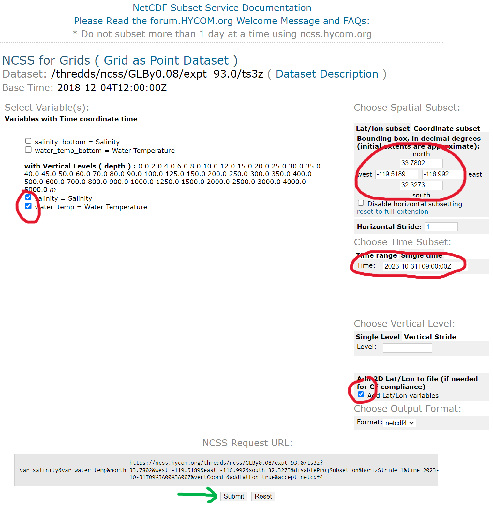

# HYCOM database
Instructions to import sound speed profile data from [HYCOM](https://www.hycom.org/) along with [GEBCO](gebco/README.md) bathymetry data.

## TLDR;
Select a region and time on GEBCO and HYCOM, download .asc and .nc4, and convert to bellhop with MATLAB.

## Example
We will download a region and convert the data for use in [bellhop](https://github.com/A-New-BellHope/bellhopcuda).

If you haven't already downloaded the bathymetry example from [GEBCO](gebco/README.md), then do so now.

1. Select a region and time

The sound speed data since 2018 are available [here](https://ncss.hycom.org/thredds/ncss/grid/GLBy0.08/expt_93.0/ts3z/dataset.html). Older data may also be available in the older 'experiments'.



2. Download the netcdf4 file by clicking the download button.

The download may be a little slow.

3. In the MATLAB tool, point the `GEBCO_FILE_NAME` and `HYCOM_FILE_NAME` variables to your files. For example, to parse the included file:
```matlab
GEBCO_FILE_NAME = 'gebco_2022_n33.7802_s32.3273_w-119.5189_e-116.992.asc';
HYCOM_FILE_NAME = 'expt_93_ts3z.nc4';
```
..* Tip - The script projects on the Earth with [Mapping Toolbox](https://www.mathworks.com/products/mapping.html).

You can also set output files and may want to look closely at how SSP is estimated under land, where HYCOM doesn't have data.

4. Load into BELLHOP.

At this point, the .bty and .ssp files may be used in Bellhop as usual. There is a sample .env script available that calculates a few rays and shows the format for using the data.

